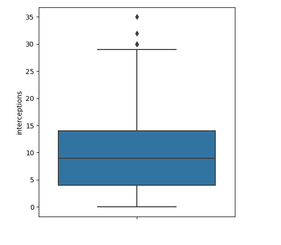
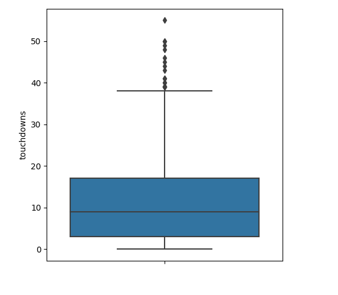

# Pro Bowler Prediction

This project's entire purpose is to predict whether a given NFL quarterback will make it to the 
Pro Bowl or not based on various machine learning models that have been trained on historical data.
The knowledge gained from this project may help you select fantasy football options for next year,
evaluate Quarterback strength objectively from a non-objective game such as the Pro Bowl, or simply
flex on your friends with your newfound NFL IQ.

### Environment
Please make sure that the following python libraries are installed and that you are on a Python 3.8 system.
```
bs4
requests
pandas
seaborn
matplotlib
sklearn
numpy
scipy
imblearn
itertools
tensorflow
keras
pickle
```

### Usage
In order to run the entirety of the project from data retrieval to creation of visualizations
to preprocessing to model training and saving, run the following command. Please ensure that you are using Python
3.8.
```
python3 full_experiment.py
```

In order to run just the single ensemble prediction after running the full experiment, go to 
the file ensemble_predictor.py, and change line 44 so that it points to the CSV with the QB stats
you want to predict on, making sure that the CSV adhere to the specification in the docstring of
that module. Then, run the following command:
```
python3 ensemble_predictor.py
```

------------------------------------------------------------
#### Data Acquisition
My data acquisition functions are in the retrieve_csv.py module and are called in the full_experiment.py
program. I looped over the NFL seasons from 1960 to 2019 and performed an HTTP request using the requests 
module for each of those years, specifying the URL of the data tables based on the year. Then,
I used BeautifulSoup to simply retrieve each table. I dropped some columns and rows that were not
necessary for my project, and then I renamed some columns and changed some values around to make it
more friendly to machine learning approaches.

#### Data Exploration
I used histograms for each column and colored it based on the Pro Bowl status of the players. This allowed me 
to get a general feel for the data that I was dealing with. These are a few of the histograms I
plotted:


As you can see, the histograms generally show histograms that do are not too much of a cause for concern.
Sometimes, the distributions are relatively normal. Other times, the distributions are skewed. However,
what is more important than a normal distribution is the distributions of each category. The coloring 
shows that each category has a similar distribution among columns, however, the Pro Bowlers are 
shifted slightly towards the more favorable stats.

I used boxplot to observe outliers, and I dealt with outliers by simply removing rows that had
any column values more than 3 Z-scores away from the mean of that column. This did not trim the data
down too much, so I was satisfied. By definition, Pro Bowlers are outliers, so I did not want to do 
anything too crazy here. Some example boxplots are shown below.






The pairplot was used to show correlation between columns, and I colored the data by category
just as with the histogram. The image is very dense, so I recommend opening up the picture in a separate 
window. There is correlation between obvious columns such as touchdowns and touchdown percentage.


In order to evaluate the distribution further, I used seaborn to fit Kernel Density Estimation
Curves on the histograms from earlier, again coloring by class. What is especially interesting is the
Win column distribution, as Pro Bowlers tend to have more wins than their less skilled counterparts. Some 
of these curve fits were awkward, like the game winning drives's distribution.


#### Preprocessing

Missing values were trivial to deal with, as I handled it in the retrieve_csv.py. There were some
stats that were added in 1970, but the QBs before did not have those, so I had to drop those
columns. Some QBs did not have stats for columns like fourth-quarter comebacks. For these, I felt it 
was ok to impute them with 0, as if the true value was not 0, it would have been recorded.

Within the actual preprocess.py module, I remove outliers based on Z-scores, and I have a function
that standardizes each feature column in a dataframe, assuming the class is the first column.

I did not have to use dummy encoding as none of my predictors were categorical; they were all numerical.
Because of my visualizations from earlier, I did not feel the need to transform the data, but I did
feature engineer Win and Loss columns from the existing QBRec column, as a QB's record is very
important in determining whether they make the Pro Bowl that year.

For further information, I also performed PCA both before and after SMOTE label balancing. It was mainly 
a way for me to assure myself that SMOTE did not do anything that was too problematic.


The fact that there are well defined clusters when I color by class in the post-SMOTE dataset is a good
sign.

#### Model Selection

I chose the standard 80-20 split, and then, because of that imbalance between Pro Bowlers and non-Pro
Bowlers, I applied SMOTE to the training dataset. The imbalance was to be expected simply due
to the nature of the classification problem. 

I used a Random Forest Classifier, Logistic Regression Model, and a Neural Network, and fed
each of these with the same training and testing dataset. For the random forest classifier, I 
initially used mostly the default parameters. For the logistic regression, I used the liblinear
solver, which is said to be ideal for small datasets. My neural network was a fully-connected model
with alternating dense and dropout layers with ReLU activation functions and a final sigmoid activation
function. No label encoding was necessary for this binary classification problem.

These three models were chosen due to their similarity and also because the dataset was small and
did not have too many predictors. It is a case that is not as uncommon as one would think, so I think
it was worthwhile to examine these three techniques for a quick way to create an accurate classifier for
such a problem.

#### Evaluation

In the main script, full_experiment, I call three functions that each correspond to the three models'
functions in the models.py module. The classification report is created for each of the models.
On the most recent run at the time of writing this README, the metrics are as follows. It is not
too surprising that the scores for the Pro Bowler class are lower, as it would naturally be harder
to predict a Pro Bowl caliber quarterback than otherwise. The accuracies are essentially the same
for each model, showing that these are all viable relative to each other.

##### Random Forest Classifier
|  | Precision | Recall | F1 | Support |
| --- | --- | --- | --- | --- |
| `Non-Pro Bowler` | 0.94 | 0.93 | 0.93 | 442 |
| `Pro Bowler` | 0.61 | 0.65 | 0.63 | 79 |
| `Accuracy` |  |  | 0.88 | 521 |
| `Macro Average` | 0.78 | 0.79 | 0.78 | 521 |
| `Weighted Average` | 0.89 | 0.88 | 0.89 | 521 |

##### Logistic Regression Model
|  | Precision | Recall | F1 | Support |
| --- | --- | --- | --- | --- |
| `Non-Pro Bowler` | 0.97 | 0.89 | 0.93 | 442 |
| `Pro Bowler` | 0.57 | 0.84 | 0.68 | 79 |
| `Accuracy` |  |  | 0.88 | 521 |
| `Macro Average` | 0.77 | 0.86 | 0.80 | 521 |
| `Weighted Average` | 0.91 | 0.88 | 0.89 | 521 |

##### Neural Network
|  | Precision | Recall | F1 | Support |
| --- | --- | --- | --- | --- |
| `Non-Pro Bowler` | 0.94 | 0.92 | 0.93 | 442 |
| `Pro Bowler` | 0.60 | 0.67 | 0.63 | 79 |
| `Accuracy` |  |  | 0.88 | 521 |
| `Macro Average` | 0.77 | 0.80 | 0.78 | 521 |
| `Weighted Average` | 0.89 | 0.88 | 0.89 | 521 |

For the neural network, I also plotted the accuracy and loss over each epoch.


The fact that the accuracy is increasing steadily is a good sign, and the validation is swinging rapidly
likely due to the small validation dataset. The same can be said of the loss. Each of the functions
of the models also call helper functions that plot the ROC Curves and confusion matrix of the 
held out testing data sets. Note that this test set was not affected in anyway by SMOTE. The results are
shown below. 


The ROC Curves are all very similar and they are all decent, showing that models are all performing
very well and similarly.


However, based on the confusion matrices, the logistic regression model significantly outperforms the
other two models, as it is able to distinguish Pro Bowl players more accurately.

I also performed a K-fold cross validation using a function I created that creates identical models
with the same random state, and I append the data to give the full X and y datasets, including SMOTE
data, to this function. The K fold results are as follows:
```
Random Forest Accuracy: 0.945 with standard deviation of 0.009
Logistic Regression Accuracy: 0.902 with standard deviation of 0.012
Neural Network  Accuracy: 0.972 with standard deviation of 0.015
```
Based on the K-fold cross validation with 10 folds, it seems that the logistic regression performed the
worst, which is interesting considering that the confusion matrices said otherwise. Also surprisingly,
the neural network had the best results in the K-fold cross validation, while it was similar to the 
random forest throughout the other results. For these reasons, I can state with confidence that each
model performs very similarly and performs surprisingly well despite the small amount of training data
and predictors.

I thought I could get better results with fine tuning of the hyperparameters, and the current neural network
is the result of tweaking the architecture, batch size, and epochs until I found the sweet spot
via trial and error. The logistic regression did not require much tweaking, although I did explore 
different solvers with no discernible differences. For the random forest, I found the best
hyperparameters via the improved_random_forest function in the models.py module. Here, I take advantage
of the RandomSearchCV class. The parameters that were the best are as follows:
```
{'n_estimators': 196, 'min_samples_split': 10, 'max_leaf_nodes': 49, 'max_features': 0.7, 'max_depth': 17, 'bootstrap': True}
```
The classification report is as follows:
##### Improved Random Forest Classifier
|  | Precision | Recall | F1 | Support |
| --- | --- | --- | --- | --- |
| `Non-Pro Bowler` | 0.95 | 0.93 | 0.94 | 442 |
| `Pro Bowler` | 0.63 | 0.72 | 0.67 | 79 |
| `Accuracy` |  |  | 0.89 | 521 |
| `Macro Average` | 0.79 | 0.82 | 0.81 | 521 |
| `Weighted Average` | 0.90 | 0.89 | 0.90 | 521 |

The accompanying figures are as follows:


As you can see, there are slight improvements. Because of this, I ended up saving this model along with
the neural network and logistic regression for use in the ensemble classifier. I saved the forest and
regression models via Pickle and the neural network via built-in Keras functionality.

#### Ensemble
Just for thoroughness, I created a bagging ensemble classifier using the BaggingClassifier class.
The results were as follows via the K-fold cross validation: 
```
Bagging Ensemble Accuracy: 0.942 with standard deviation of 0.013
```
As you can see, there is no discernible difference between the ensemble tree classifier and the regular
tree classifier. 

In the ensemble_predictor.py module, I have a function that loads the three saved models, and then
takes in a dataframe with corresponding predictor columns to perform predictions on that dataset.
The dataframe is standardized first. For each row in the dataframe, each model predicts whether the
player is a Pro Bowler or not. Then, the majority of the three models' results are used as a Max
Voting method in order to determine whether that player is a Pro Bowler ot not. A simply Max Voting
approach made sense because of the binary classification and the very close behavior of each model. 

This module is also used after running full_experiment.py to predict on entirely new data, apart from the training
and testing data. Simply set the path of the dataframe with this new dataframe on line 44 in ensemble.predictor.py.

